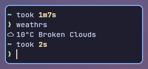
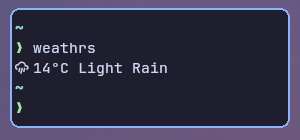
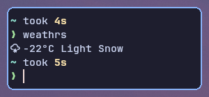
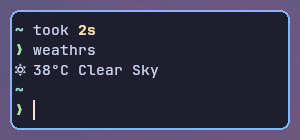

# WeathRS

WeathRS is a lightweight command-line weather application written in rust.

## Features

- Easily set your OpenWeatherMap API key, location name, and temperature format preferences.
- Retrieve weather information based on the configured location using the OpenWeatherMap API.

## Usage

### Installation

1. Clone the repository:

```bash
git clone https://github.com/selirra/weathrs.git
```

2. Build the project:

```bash
cd weathrs
cargo build --release
```

### Configuration

Before using WeathRS, you need to configure it by setting your OpenWeatherMap API key, location name, and temperature format.  
Use the following subcommands:

- Set API key:

```bash
./weathrs key <your-api-key>
```

- Set location name:

```bash
./weathrs location <your-location-name>
```

- Set temperature format (options: celsius, fahrenheit, kelvin):

```bash
./weathrs temperature-format <your-preferred-format>
```

### Query Weather Information

Once configured, you can query weather information using:

```bash
./weathrs
```

This will display the current weather information based on your configured location.  

## Screenshots

<p align="center">




</p>

## License

This project is licensed under the MIT License - see the [license](license.md) file for details.

